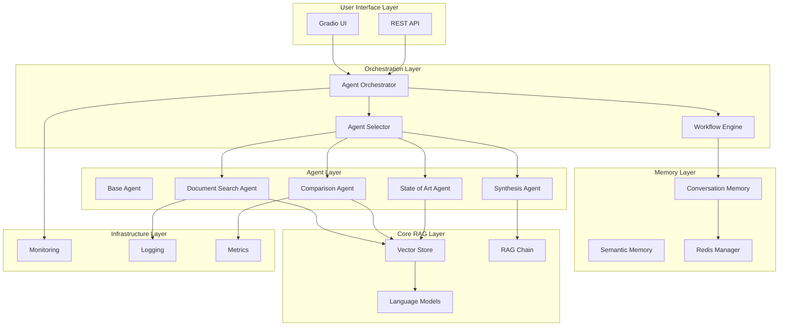

# Diseño Técnico: Sistema de Agentes RAG Completo

## Resumen Ejecutivo

Este documento detalla el diseño técnico para completar el sistema de agentes RAG, transformando la implementación parcial actual en una arquitectura multi-agente completamente funcional con capacidades avanzadas de razonamiento, memoria conversacional y orquestación inteligente.

### Objetivos Técnicos

1. **Arquitectura Escalable**: Sistema de agentes que soporte 10+ agentes especializados
2. **Performance Óptima**: <15s respuesta individual, <30s orquestación multi-agente
3. **Memoria Inteligente**: Sistema conversacional con contexto semántico persistente
4. **Observabilidad Total**: Métricas, trazas y monitoreo en tiempo real
5. **Compatibilidad**: 100% backward compatibility con RAG clásico

---

## Arquitectura General

### Diagrama de Arquitectura



### Principios de Diseño

1. **Modularidad**: Cada agente es independiente y reemplazable
2. **Composabilidad**: Agentes pueden combinarse para tareas complejas
3. **Observabilidad**: Cada operación es trazable y medible
4. **Resilencia**: Fallbacks automáticos y manejo robusto de errores
5. **Extensibilidad**: Fácil adición de nuevos agentes especializados

---

## Componentes Detallados

### 1. Base Agent Architecture

#### BaseAgent (Clase Abstracta)

```python
from abc import ABC, abstractmethod
from typing import Dict, List, Any, Optional
from dataclasses import dataclass
from enum import Enum
import uuid
import time

class AgentCapability(Enum):
    DOCUMENT_SEARCH = "document_search"
    COMPARISON_ANALYSIS = "comparison_analysis"
    STATE_OF_ART = "state_of_art_synthesis"
    SYNTHESIS = "information_synthesis"
    REASONING = "multi_step_reasoning"

@dataclass
class AgentResponse:
    agent_id: str
    agent_name: str
    content: str
    confidence: float
    reasoning: str
    sources: List[Dict[str, Any]]
    metadata: Dict[str, Any]
    processing_time_ms: float
    capabilities_used: List[AgentCapability]

@dataclass
class AgentStats:
    total_queries: int
    success_rate: float
    avg_response_time_ms: float
    avg_confidence: float
    error_count: int
    last_error: Optional[str]
    capabilities: List[AgentCapability]

class BaseAgent(ABC):
    def __init__(self, name: str, description: str):
        self.agent_id = str(uuid.uuid4())
        self.name = name
        self.description = description
        self.stats = AgentStats(
            total_queries=0,
            success_rate=0.0,
            avg_response_time_ms=0.0,
            avg_confidence=0.0,
            error_count=0,
            last_error=None,
            capabilities=self.get_capabilities()
        )
        self._initialize_agent()
    
    @abstractmethod
    def get_capabilities(self) -> List[AgentCapability]:
        """Retorna las capacidades específicas del agente"""
        pass
    
    @abstractmethod
    def can_handle_query(self, query: str, context: Optional[Dict] = None) -> float:
        """
        Evalúa si el agente puede manejar la consulta
        Returns: confidence score 0.0-1.0
        """
        pass
    
    @abstractmethod
    async def process_query(self, query: str, context: Optional[Dict] = None) -> AgentResponse:
        """Procesa la consulta y retorna respuesta estructurada"""
        pass
    
    def _initialize_agent(self):
        """Inicialización específica del agente"""
        pass
    
    def get_stats(self) -> AgentStats:
        """Retorna estadísticas actuales del agente"""
        return self.stats
    
    def _update_stats(self, success: bool, response_time_ms: float, confidence: float, error: str = None):
        """Actualiza estadísticas internas"""
        self.stats.total_queries += 1
        if success:
            # Actualizar promedio de tiempo de respuesta
            total_time = self.stats.avg_response_time_ms * (self.stats.total_queries - 1)
            self.stats.avg_response_time_ms = (total_time + response_time_ms) / self.stats.total_queries
            
            # Actualizar promedio de confidence
            total_conf = self.stats.avg_confidence * (self.stats.total_queries - 1)
            self.stats.avg_confidence = (total_conf + confidence) / self.stats.total_queries
        else:
            self.stats.error_count += 1
            self.stats.last_error = error
        
        # Actualizar success rate
        successful_queries = self.stats.total_queries - self.stats.error_count
        self.stats.success_rate = successful_queries / self.stats.total_queries
```

#### Agent Registry

```python
from typing import Dict, List, Type
import logging

class AgentRegistry:
    def __init__(self):
        self._agents: Dict[str, BaseAgent] = {}
        self._agent_types: Dict[str, Type[BaseAgent]] = {}
        self.logger = logging.getLogger(__name__)
    
    def register_agent(self, agent: BaseAgent):
        """Registra un agente en el sistema"""
        self._agents[agent.agent_id] = agent
        self._agent_types[agent.name] = type(agent)
        self.logger.info(f"Registered agent: {agent.name} ({agent.agent_id})")
    
    def get_agent(self, agent_id: str) -> Optional[BaseAgent]:
        """Obtiene agente por ID"""
        return self._agents.get(agent_id)
    
    def get_agents_by_capability(self, capability: AgentCapability) -> List[BaseAgent]:
        """Obtiene agentes que tienen una capacidad específica"""
        return [
            agent for agent in self._agents.values()
            if capability in agent.get_capabilities()
        ]
    
    def get_all_agents(self) -> List[BaseAgent]:
        """Retorna todos los agentes registrados"""
        return list(self._agents.values())
    
    def get_agent_stats(self) -> Dict[str, AgentStats]:
        """Retorna estadísticas de todos los agentes"""
        return {
            agent.name: agent.get_stats()
            for agent in self._agents.values()
        }
    
    def health_check(self) -> Dict[str, bool]:
        """Verifica salud de todos los agentes"""
        health_status = {}
        for agent in self._agents.values():
            try:
                # Test básico de funcionalidad
                score = agent.can_handle_query("test query")
                health_status[agent.name] = isinstance(score, float) and 0 <= score <= 1
            except Exception as e:
                health_status[agent.name] = False
                self.logger.error(f"Health check failed for {agent.name}: {e}")
        
        return health_status
```

### 2. Document Search Agent

#### Implementación Especializada

```python
from typing import List, Dict, Any, Optional
import asyncio
from src.utils.intent_detector import IntentType
from src.storage.vector_store import VectorStoreManager
from src.chains.rag_chain import RAGChain

class DocumentSearchAgent(BaseAgent):
    def __init__(self, vector_store_manager: VectorStoreManager, rag_chain: RAGChain):
        super().__init__(
            name="DocumentSearchAgent",
            description="Specialized agent for academic document search and retrieval"
        )
        self.vector_store = vector_store_manager
        self.rag_chain = rag_chain
        self.academic_keywords = self._load_academic_keywords()
    
    def get_capabilities(self) -> List[AgentCapability]:
        return [
            AgentCapability.DOCUMENT_SEARCH,
            AgentCapability.SYNTHESIS
        ]
    
    def can_handle_query(self, query: str, context: Optional[Dict] = None) -> float:
        """
        Evalúa capacidad de manejar consultas de búsqueda documental
        """
        confidence = 0.0
        
        # Palabras clave académicas
        academic_indicators = [
            "papers", "research", "studies", "literature", "methodology",
            "findings", "results", "analysis", "framework", "approach"
        ]
        
        query_lower = query.lower()
        academic_matches = sum(1 for keyword in academic_indicators if keyword in query_lower)
        confidence += min(academic_matches * 0.15, 0.6)
        
        # Patrones de búsqueda
        search_patterns = [
            "find", "search", "look for", "show me", "what are",
            "busca", "encuentra", "muestra", "cuáles son"
        ]
        
        if any(pattern in query_lower for pattern in search_patterns):
            confidence += 0.3
        
        # Boost si no es comparativa o estado del arte
        if not any(comp in query_lower for comp in ["compare", "versus", "state of art"]):
            confidence += 0.1
        
        return min(confidence, 1.0)
    
    async def process_query(self, query: str, context: Optional[Dict] = None) -> AgentResponse:
        """
        Procesa consulta de búsqueda documental con síntesis avanzada
        """
        start_time = time.time()
        
        try:
            # 1. Expandir consulta con términos académicos
            expanded_query = await self._expand_academic_query(query)
            
            # 2. Búsqueda vectorial con filtros académicos
            documents = await self._search_documents(expanded_query, context)
            
            # 3. Ranking por relevancia académica
            ranked_docs = await self._rank_by_academic_relevance(documents, query)
            
            # 4. Síntesis de múltiples fuentes
            synthesized_response = await self._synthesize_sources(query, ranked_docs)
            
            # 5. Enriquecer con metadata académica
            enriched_response = await self._enrich_with_metadata(synthesized_response, ranked_docs)
            
            processing_time = (time.time() - start_time) * 1000
            confidence = self._calculate_response_confidence(ranked_docs, synthesized_response)
            
            response = AgentResponse(
                agent_id=self.agent_id,
                agent_name=self.name,
                content=enriched_response,
                confidence=confidence,
                reasoning=f"Processed {len(ranked_docs)} academic sources with expanded query",
                sources=self._format_sources(ranked_docs),
                metadata={
                    "expanded_query": expanded_query,
                    "documents_found": len(documents),
                    "documents_used": len(ranked_docs),
                    "academic_relevance_avg": self._avg_relevance(ranked_docs)
                },
                processing_time_ms=processing_time,
                capabilities_used=[AgentCapability.DOCUMENT_SEARCH, AgentCapability.SYNTHESIS]
            )
            
            self._update_stats(True, processing_time, confidence)
            return response
            
        except Exception as e:
            processing_time = (time.time() - start_time) * 1000
            self._update_stats(False, processing_time, 0.0, str(e))
            raise
    
    async def _expand_academic_query(self, query: str) -> str:
        """Expande consulta con términos académicos relacionados"""
        # Implementar expansión semántica específica para documentos académicos
        pass
    
    async def _search_documents(self, query: str, context: Optional[Dict]) -> List[Dict]:
        """Búsqueda vectorial con filtros académicos"""
        # Implementar búsqueda avanzada con filtros de calidad académica
        pass
    
    async def _rank_by_academic_relevance(self, documents: List[Dict], query: str) -> List[Dict]:
        """Ranking por relevancia académica específica"""
        # Implementar scoring que considere autoridad, recencia, relevancia
        pass
    
    async def _synthesize_sources(self, query: str, documents: List[Dict]) -> str:
        """Síntesis inteligente de múltiples fuentes académicas"""
        # Implementar síntesis que identifique consensos y controversias
        pass
```

### 3. Comparison Agent

#### Análisis Comparativo Especializado

```python
class ComparisonAgent(BaseAgent):
    def __init__(self, vector_store_manager: VectorStoreManager, rag_chain: RAGChain):
        super().__init__(
            name="ComparisonAgent", 
            description="Specialized agent for comparative analysis of methodologies and approaches"
        )
        self.vector_store = vector_store_manager
        self.rag_chain = rag_chain
        self.comparison_templates = self._load_comparison_templates()
    
    def get_capabilities(self) -> List[AgentCapability]:
        return [
            AgentCapability.COMPARISON_ANALYSIS,
            AgentCapability.REASONING,
            AgentCapability.SYNTHESIS
        ]
    
    def can_handle_query(self, query: str, context: Optional[Dict] = None) -> float:
        """Detecta consultas que requieren análisis comparativo"""
        confidence = 0.0
        query_lower = query.lower()
        
        # Palabras clave comparativas explícitas
        comparison_keywords = [
            "compare", "versus", "vs", "difference", "differences",
            "compara", "diferencia", "diferencias", "contrasta"
        ]
        
        explicit_comparison = any(keyword in query_lower for keyword in comparison_keywords)
        if explicit_comparison:
            confidence += 0.7
        
        # Patrones comparativos implícitos
        implicit_patterns = [
            "advantages and disadvantages", "pros and cons", "better than",
            "ventajas y desventajas", "mejor que", "superior a"
        ]
        
        if any(pattern in query_lower for pattern in implicit_patterns):
            confidence += 0.6
        
        # Múltiples entidades mencionadas
        entities = self._extract_entities(query)
        if len(entities) >= 2:
            confidence += 0.3
        
        # Conjunciones que indican comparación
        conjunctions = ["and", "or", "versus", "y", "o"]
        conjunction_count = sum(1 for conj in conjunctions if conj in query_lower)
        confidence += min(conjunction_count * 0.1, 0.2)
        
        return min(confidence, 1.0)
    
    async def process_query(self, query: str, context: Optional[Dict] = None) -> AgentResponse:
        """Procesa análisis comparativo estructurado"""
        start_time = time.time()
        
        try:
            # 1. Extraer entidades a comparar
            entities = await self._extract_comparison_entities(query)
            
            # 2. Definir criterios de comparación
            criteria = await self._define_comparison_criteria(entities, query)
            
            # 3. Recopilar información por entidad
            entity_data = await self._gather_entity_information(entities, criteria)
            
            # 4. Generar matriz de comparación
            comparison_matrix = await self._generate_comparison_matrix(entity_data, criteria)
            
            # 5. Análizar trade-offs
            tradeoff_analysis = await self._analyze_tradeoffs(comparison_matrix, entities)
            
            # 6. Generar recomendaciones contextualizadas
            recommendations = await self._generate_recommendations(comparison_matrix, query)
            
            # 7. Estructurar respuesta final
            structured_response = await self._structure_comparison_response(
                comparison_matrix, tradeoff_analysis, recommendations
            )
            
            processing_time = (time.time() - start_time) * 1000
            confidence = self._calculate_comparison_confidence(entity_data, criteria)
            
            response = AgentResponse(
                agent_id=self.agent_id,
                agent_name=self.name,
                content=structured_response,
                confidence=confidence,
                reasoning=f"Compared {len(entities)} entities across {len(criteria)} criteria",
                sources=self._format_comparison_sources(entity_data),
                metadata={
                    "entities_compared": entities,
                    "comparison_criteria": criteria,
                    "matrix_completeness": self._calculate_matrix_completeness(comparison_matrix),
                    "evidence_balance": self._assess_evidence_balance(entity_data)
                },
                processing_time_ms=processing_time,
                capabilities_used=[
                    AgentCapability.COMPARISON_ANALYSIS,
                    AgentCapability.REASONING,
                    AgentCapability.SYNTHESIS
                ]
            )
            
            self._update_stats(True, processing_time, confidence)
            return response
            
        except Exception as e:
            processing_time = (time.time() - start_time) * 1000
            self._update_stats(False, processing_time, 0.0, str(e))
            raise
    
    async def _extract_comparison_entities(self, query: str) -> List[str]:
        """Extrae entidades específicas a comparar"""
        # Implementar NER especializado para entidades académicas
        pass
    
    async def _define_comparison_criteria(self, entities: List[str], query: str) -> List[str]:
        """Define criterios relevantes para la comparación"""
        # Implementar selección inteligente de criterios basada en dominio
        pass
```

### 4. Memory System

#### Conversational Memory Manager

```python
import redis
import json
from typing import Dict, List, Any, Optional
from datetime import datetime, timedelta
import hashlib

class ConversationMemory:
    def __init__(self, redis_client: redis.Redis):
        self.redis = redis_client
        self.default_ttl = 30 * 24 * 60 * 60  # 30 días
        self.max_conversation_length = 50  # máximo intercambios por sesión
    
    def add_to_conversation(self, session_id: str, role: str, content: str, metadata: Dict = None):
        """Añade mensaje a la conversación"""
        conversation_key = f"conversation:{session_id}"
        
        message = {
            "role": role,
            "content": content,
            "timestamp": datetime.utcnow().isoformat(),
            "metadata": metadata or {}
        }
        
        # Añadir a la lista de conversación
        self.redis.lpush(conversation_key, json.dumps(message))
        
        # Mantener límite de longitud
        self.redis.ltrim(conversation_key, 0, self.max_conversation_length - 1)
        
        # Establecer TTL
        self.redis.expire(conversation_key, self.default_ttl)
        
        # Actualizar índice semántico si es respuesta del asistente
        if role == "assistant":
            self._update_semantic_index(session_id, content, metadata)
    
    def get_conversation_history(self, session_id: str, limit: int = 10) -> List[Dict]:
        """Obtiene historial de conversación"""
        conversation_key = f"conversation:{session_id}"
        messages = self.redis.lrange(conversation_key, 0, limit - 1)
        
        return [json.loads(msg) for msg in messages]
    
    def _update_semantic_index(self, session_id: str, content: str, metadata: Dict):
        """Actualiza índice semántico para búsqueda de contexto"""
        # Crear hash del contenido para deduplicación
        content_hash = hashlib.md5(content.encode()).hexdigest()
        
        semantic_entry = {
            "session_id": session_id,
            "content": content,
            "content_hash": content_hash,
            "timestamp": datetime.utcnow().isoformat(),
            "metadata": metadata,
            "concepts": self._extract_concepts(content)
        }
        
        semantic_key = f"semantic:{session_id}:{content_hash}"
        self.redis.setex(semantic_key, self.default_ttl, json.dumps(semantic_entry))
        
        # Añadir a índice de conceptos
        for concept in semantic_entry["concepts"]:
            concept_key = f"concept:{concept}"
            self.redis.sadd(concept_key, semantic_key)
            self.redis.expire(concept_key, self.default_ttl)

class SemanticMemory:
    def __init__(self, redis_client: redis.Redis, vector_store_manager):
        self.redis = redis_client
        self.vector_store = vector_store_manager
        self.concept_threshold = 0.7  # umbral de similitud semántica
    
    def search_semantic_memory(self, query: str, session_id: str = None, k: int = 5) -> List[Dict]:
        """Busca en memoria semántica por similitud"""
        # 1. Buscar conceptos relacionados
        query_concepts = self._extract_concepts(query)
        related_entries = []
        
        for concept in query_concepts:
            concept_key = f"concept:{concept}"
            entry_keys = self.redis.smembers(concept_key)
            
            for entry_key in entry_keys:
                entry_data = self.redis.get(entry_key)
                if entry_data:
                    entry = json.loads(entry_data)
                    if not session_id or entry["session_id"] == session_id:
                        related_entries.append(entry)
        
        # 2. Ranking por relevancia semántica
        ranked_entries = self._rank_by_semantic_similarity(query, related_entries)
        
        return ranked_entries[:k]
    
    def _extract_concepts(self, text: str) -> List[str]:
        """Extrae conceptos clave del texto"""
        # Implementar extracción de conceptos usando NLP
        # Por ahora, implementación simple con keywords
        academic_concepts = [
            "machine learning", "deep learning", "nlp", "ai", "algorithm",
            "methodology", "framework", "approach", "analysis", "research"
        ]
        
        text_lower = text.lower()
        found_concepts = [concept for concept in academic_concepts if concept in text_lower]
        
        return found_concepts
    
    def _rank_by_semantic_similarity(self, query: str, entries: List[Dict]) -> List[Dict]:
        """Ranking por similitud semántica"""
        # Implementar usando embeddings para calcular similitud
        # Por ahora, ranking simple por número de conceptos compartidos
        
        query_concepts = set(self._extract_concepts(query))
        
        for entry in entries:
            entry_concepts = set(entry.get("concepts", []))
            similarity = len(query_concepts.intersection(entry_concepts)) / len(query_concepts.union(entry_concepts))
            entry["similarity_score"] = similarity
        
        return sorted(entries, key=lambda x: x.get("similarity_score", 0), reverse=True)

class MemoryManager:
    def __init__(self, redis_url: str, vector_store_manager):
        self.redis_client = redis.from_url(redis_url, decode_responses=True)
        self.conversation_memory = ConversationMemory(self.redis_client)
        self.semantic_memory = SemanticMemory(self.redis_client, vector_store_manager)
    
    def add_to_conversation(self, session_id: str, role: str, content: str, metadata: Dict = None):
        """Proxy para añadir a conversación"""
        self.conversation_memory.add_to_conversation(session_id, role, content, metadata)
    
    def get_conversation_history(self, session_id: str, limit: int = 10) -> List[Dict]:
        """Proxy para obtener historial"""
        return self.conversation_memory.get_conversation_history(session_id, limit)
    
    def search_semantic_memory(self, query: str, session_id: str = None, k: int = 5) -> List[Dict]:
        """Proxy para búsqueda semántica"""
        return self.semantic_memory.search_semantic_memory(query, session_id, k)
    
    def get_memory_stats(self) -> Dict[str, Any]:
        """Estadísticas de uso de memoria"""
        try:
            info = self.redis_client.info()
            return {
                "redis_connected": True,
                "used_memory": info.get("used_memory_human", "Unknown"),
                "connected_clients": info.get("connected_clients", 0),
                "total_keys": self.redis_client.dbsize(),
                "memory_fragmentation_ratio": info.get("mem_fragmentation_ratio", 0)
            }
        except Exception as e:
            return {
                "redis_connected": False,
                "error": str(e)
            }
```

### 5. Agent Orchestrator

#### Orquestación Inteligente Multi-Agente

```python
from typing import List, Dict, Any, Optional, Tuple
import asyncio
from enum import Enum
import logging

class OrchestrationStrategy(Enum):
    SINGLE_AGENT = "single_agent"
    SEQUENTIAL = "sequential"
    PARALLEL = "parallel"
    HIERARCHICAL = "hierarchical"

class WorkflowStep:
    def __init__(self, agent: BaseAgent, input_query: str, dependencies: List[str] = None):
        self.agent = agent
        self.input_query = input_query
        self.dependencies = dependencies or []
        self.result: Optional[AgentResponse] = None
        self.status = "pending"  # pending, running, completed, failed

class AgentOrchestrator:
    def __init__(self, agent_registry: AgentRegistry, memory_manager: MemoryManager):
        self.agent_registry = agent_registry
        self.memory_manager = memory_manager
        self.logger = logging.getLogger(__name__)
        
        # Configuración de orquestación
        self.confidence_threshold = 0.7
        self.max_parallel_agents = 3
        self.agent_timeout = 30  # segundos
        
        # Métricas de orquestación
        self.orchestration_stats = {
            "total_orchestrations": 0,
            "single_agent_count": 0,
            "multi_agent_count": 0,
            "avg_orchestration_time": 0.0,
            "success_rate": 0.0
        }
    
    async def orchestrate_query(self, query: str, session_id: str = None, context: Dict = None) -> AgentResponse:
        """Orquesta la consulta usando la estrategia óptima"""
        start_time = time.time()
        
        try:
            # 1. Analizar consulta y determinar estrategia
            strategy, workflow_steps = await self._plan_orchestration(query, context)
            
            # 2. Obtener contexto de memoria si está disponible
            memory_context = await self._get_memory_context(query, session_id)
            
            # 3. Ejecutar workflow según estrategia
            if strategy == OrchestrationStrategy.SINGLE_AGENT:
                result = await self._execute_single_agent(workflow_steps[0], memory_context)
            elif strategy == OrchestrationStrategy.SEQUENTIAL:
                result = await self._execute_sequential(workflow_steps, memory_context)
            elif strategy == OrchestrationStrategy.PARALLEL:
                result = await self._execute_parallel(workflow_steps, memory_context)
            else:  # HIERARCHICAL
                result = await self._execute_hierarchical(workflow_steps, memory_context)
            
            # 4. Guardar en memoria conversacional
            if session_id and self.memory_manager:
                self.memory_manager.add_to_conversation(
                    session_id, "assistant", result.content,
                    {"orchestration_strategy": strategy.value, "agents_used": len(workflow_steps)}
                )
            
            # 5. Actualizar métricas
            orchestration_time = (time.time() - start_time) * 1000
            self._update_orchestration_stats(True, orchestration_time, strategy)
            
            return result
            
        except Exception as e:
            orchestration_time = (time.time() - start_time) * 1000
            self._update_orchestration_stats(False, orchestration_time, OrchestrationStrategy.SINGLE_AGENT)
            self.logger.error(f"Orchestration failed: {e}")
            
            # Fallback a RAG clásico
            return await self._fallback_to_classic_rag(query)
    
    async def _plan_orchestration(self, query: str, context: Dict = None) -> Tuple[OrchestrationStrategy, List[WorkflowStep]]:
        """Planifica la estrategia de orquestación óptima"""
        
        # 1. Evaluar todos los agentes disponibles
        agent_scores = {}
        agents = self.agent_registry.get_all_agents()
        
        for agent in agents:
            try:
                score = agent.can_handle_query(query, context)
                if score >= 0.3:  # umbral mínimo
                    agent_scores[agent] = score
            except Exception as e:
                self.logger.warning(f"Error evaluating agent {agent.name}: {e}")
        
        if not agent_scores:
            # Fallback a RAG clásico
            raise Exception("No agents available for query")
        
        # 2. Determinar estrategia basada en scores y complejidad
        query_complexity = self._assess_query_complexity(query)
        
        if len(agent_scores) == 1 or query_complexity < 0.5:
            # Estrategia de agente único
            best_agent = max(agent_scores.keys(), key=lambda a: agent_scores[a])
            return OrchestrationStrategy.SINGLE_AGENT, [WorkflowStep(best_agent, query)]
        
        elif self._requires_comparison(query):
            # Estrategia secuencial para comparaciones
            return await self._plan_comparison_workflow(query, agent_scores)
        
        elif self._requires_synthesis(query):
            # Estrategia paralela para síntesis
            return await self._plan_synthesis_workflow(query, agent_scores)
        
        else:
            # Estrategia de agente único con el mejor score
            best_agent = max(agent_scores.keys(), key=lambda a: agent_scores[a])
            return OrchestrationStrategy.SINGLE_AGENT, [WorkflowStep(best_agent, query)]
    
    async def _execute_single_agent(self, workflow_step: WorkflowStep, context: Dict) -> AgentResponse:
        """Ejecuta workflow de agente único"""
        workflow_step.status = "running"
        
        try:
            # Combinar contexto de memoria con contexto existente
            combined_context = {**(context or {}), **{"memory_context": context.get("memory_context", {})}}
            
            result = await asyncio.wait_for(
                workflow_step.agent.process_query(workflow_step.input_query, combined_context),
                timeout=self.agent_timeout
            )
            
            workflow_step.result = result
            workflow_step.status = "completed"
            
            return result
            
        except asyncio.TimeoutError:
            workflow_step.status = "failed"
            raise Exception(f"Agent {workflow_step.agent.name} timed out")
        except Exception as e:
            workflow_step.status = "failed"
            raise Exception(f"Agent {workflow_step.agent.name} failed: {e}")
    
    async def _execute_parallel(self, workflow_steps: List[WorkflowStep], context: Dict) -> AgentResponse:
        """Ejecuta workflow paralelo"""
        
        # Limitar paralelismo
        steps_to_execute = workflow_steps[:self.max_parallel_agents]
        
        # Ejecutar agentes en paralelo
        tasks = []
        for step in steps_to_execute:
            step.status = "running"
            combined_context = {**(context or {}), **{"memory_context": context.get("memory_context", {})}}
            task = asyncio.create_task(
                asyncio.wait_for(
                    step.agent.process_query(step.input_query, combined_context),
                    timeout=self.agent_timeout
                )
            )
            tasks.append((step, task))
        
        # Esperar resultados
        results = []
        for step, task in tasks:
            try:
                result = await task
                step.result = result
                step.status = "completed"
                results.append(result)
            except Exception as e:
                step.status = "failed"
                self.logger.error(f"Parallel agent {step.agent.name} failed: {e}")
        
        if not results:
            raise Exception("All parallel agents failed")
        
        # Sintetizar resultados de múltiples agentes
        return await self._synthesize_parallel_results(results, workflow_steps[0].input_query)
    
    async def _synthesize_parallel_results(self, results: List[AgentResponse], original_query: str) -> AgentResponse:
        """Sintetiza resultados de múltiples agentes"""
        
        # Combinar contenido de todos los agentes
        combined_content = []
        combined_sources = []
        combined_metadata = {}
        total_confidence = 0.0
        capabilities_used = set()
        
        for i, result in enumerate(results):
            combined_content.append(f"## Análisis {i+1} ({result.agent_name})\n{result.content}")
            combined_sources.extend(result.sources)
            combined_metadata[f"agent_{i+1}"] = {
                "name": result.agent_name,
                "confidence": result.confidence,
                "processing_time": result.processing_time_ms
            }
            total_confidence += result.confidence
            capabilities_used.update(result.capabilities_used)
        
        # Crear respuesta sintetizada
        synthesized_response = AgentResponse(
            agent_id="orchestrator",
            agent_name="AgentOrchestrator",
            content="\n\n".join(combined_content),
            confidence=total_confidence / len(results),
            reasoning=f"Synthesized results from {len(results)} specialized agents",
            sources=combined_sources,
            metadata={
                "orchestration_type": "parallel",
                "agents_used": len(results),
                "individual_results": combined_metadata
            },
            processing_time_ms=max(r.processing_time_ms for r in results),
            capabilities_used=list(capabilities_used)
        )
        
        return synthesized_response
    
    def _assess_query_complexity(self, query: str) -> float:
        """Evalúa complejidad de la consulta"""
        complexity_indicators = [
            ("multiple", 0.2), ("compare", 0.3), ("analyze", 0.2),
            ("synthesize", 0.3), ("state of art", 0.4), ("comprehensive", 0.2)
        ]
        
        query_lower = query.lower()
        complexity = 0.0
        
        for indicator, weight in complexity_indicators:
            if indicator in query_lower:
                complexity += weight
        
        # Longitud de consulta como indicador
        if len(query.split()) > 15:
            complexity += 0.2
        
        return min(complexity, 1.0)
    
    def _requires_comparison(self, query: str) -> bool:
        """Determina si la consulta requiere análisis comparativo"""
        comparison_keywords = ["compare", "versus", "vs", "difference", "compara", "diferencia"]
        return any(keyword in query.lower() for keyword in comparison_keywords)
    
    def _requires_synthesis(self, query: str) -> bool:
        """Determina si la consulta requiere síntesis de múltiples fuentes"""
        synthesis_keywords = ["comprehensive", "overview", "state of art", "synthesize", "combine"]
        return any(keyword in query.lower() for keyword in synthesis_keywords)
```

---

## Interfaces y Contratos

### API Contracts

```python
# Contrato para AgentResponse
@dataclass
class AgentResponse:
    agent_id: str
    agent_name: str
    content: str
    confidence: float  # 0.0 - 1.0
    reasoning: str
    sources: List[Dict[str, Any]]
    metadata: Dict[str, Any]
    processing_time_ms: float
    capabilities_used: List[AgentCapability]
    
    def to_dict(self) -> Dict[str, Any]:
        return {
            "agent_id": self.agent_id,
            "agent_name": self.agent_name,
            "content": self.content,
            "confidence": self.confidence,
            "reasoning": self.reasoning,
            "sources": self.sources,
            "metadata": self.metadata,
            "processing_time_ms": self.processing_time_ms,
            "capabilities_used": [cap.value for cap in self.capabilities_used]
        }

# Contrato para configuración de agentes
@dataclass
class AgentConfig:
    name: str
    enabled: bool
    confidence_threshold: float
    timeout_seconds: int
    max_retries: int
    fallback_enabled: bool
    custom_parameters: Dict[str, Any]
```

---

## Monitoreo y Observabilidad

### Métricas Clave

```python
class AgentMetrics:
    def __init__(self):
        self.metrics = {
            # Métricas por agente
            "agent_query_count": {},
            "agent_success_rate": {},
            "agent_avg_response_time": {},
            "agent_avg_confidence": {},
            
            # Métricas de orquestación
            "orchestration_strategy_usage": {},
            "multi_agent_success_rate": 0.0,
            "avg_orchestration_time": 0.0,
            
            # Métricas de memoria
            "memory_hit_rate": 0.0,
            "avg_context_relevance": 0.0,
            
            # Métricas de calidad
            "response_quality_score": 0.0,
            "user_satisfaction": 0.0
        }
    
    def record_agent_query(self, agent_name: str, success: bool, response_time: float, confidence: float):
        """Registra métricas de consulta por agente"""
        if agent_name not in self.metrics["agent_query_count"]:
            self.metrics["agent_query_count"][agent_name] = 0
            self.metrics["agent_success_rate"][agent_name] = 0.0
            self.metrics["agent_avg_response_time"][agent_name] = 0.0
            self.metrics["agent_avg_confidence"][agent_name] = 0.0
        
        # Actualizar contadores y promedios
        self.metrics["agent_query_count"][agent_name] += 1
        # ... lógica de actualización de promedios
    
    def get_dashboard_data(self) -> Dict[str, Any]:
        """Retorna datos para dashboard de monitoreo"""
        return {
            "agent_performance": self._get_agent_performance_summary(),
            "orchestration_stats": self._get_orchestration_stats(),
            "memory_stats": self._get_memory_stats(),
            "quality_metrics": self._get_quality_metrics()
        }
```

### Logging Estructurado

```python
import structlog

logger = structlog.get_logger()

# Ejemplo de logging en agentes
logger.info(
    "agent_query_processed",
    agent_name=self.name,
    query_hash=hashlib.md5(query.encode()).hexdigest()[:8],
    confidence=confidence,
    processing_time_ms=processing_time,
    capabilities_used=[cap.value for cap in capabilities_used],
    success=True
)
```

---

## Testing Strategy

### Unit Tests

```python
import pytest
import asyncio
from unittest.mock import Mock, AsyncMock

class TestDocumentSearchAgent:
    @pytest.fixture
    def agent(self):
        mock_vector_store = Mock()
        mock_rag_chain = Mock()
        return DocumentSearchAgent(mock_vector_store, mock_rag_chain)
    
    def test_can_handle_academic_query(self, agent):
        query = "Find research papers about machine learning in requirements engineering"
        confidence = agent.can_handle_query(query)
        assert confidence > 0.7
    
    def test_rejects_non_academic_query(self, agent):
        query = "What's the weather like today?"
        confidence = agent.can_handle_query(query)
        assert confidence < 0.3
    
    @pytest.mark.asyncio
    async def test_process_query_success(self, agent):
        query = "Search for NLP methodologies"
        response = await agent.process_query(query)
        
        assert isinstance(response, AgentResponse)
        assert response.agent_name == "DocumentSearchAgent"
        assert response.confidence > 0.0
        assert len(response.capabilities_used) > 0

class TestAgentOrchestrator:
    @pytest.fixture
    def orchestrator(self):
        mock_registry = Mock()
        mock_memory = Mock()
        return AgentOrchestrator(mock_registry, mock_memory)
    
    @pytest.mark.asyncio
    async def test_single_agent_orchestration(self, orchestrator):
        # Test que orquestador selecciona agente único correctamente
        pass
    
    @pytest.mark.asyncio
    async def test_parallel_orchestration(self, orchestrator):
        # Test que orquestación paralela funciona correctamente
        pass
```

### Integration Tests

```python
class TestAgentIntegration:
    @pytest.mark.asyncio
    async def test_end_to_end_document_search(self):
        # Test completo desde consulta hasta respuesta
        pass
    
    @pytest.mark.asyncio
    async def test_memory_persistence(self):
        # Test que memoria conversacional persiste correctamente
        pass
    
    @pytest.mark.asyncio
    async def test_orchestration_fallback(self):
        # Test que fallback funciona cuando agentes fallan
        pass
```

### Performance Tests

```python
class TestAgentPerformance:
    @pytest.mark.asyncio
    async def test_response_time_sla(self):
        # Test que agentes cumplen SLA de tiempo de respuesta
        pass
    
    @pytest.mark.asyncio
    async def test_concurrent_queries(self):
        # Test que sistema maneja consultas concurrentes
        pass
    
    @pytest.mark.asyncio
    async def test_memory_usage(self):
        # Test que uso de memoria está dentro de límites
        pass
```

---

## Deployment y Configuración

### Docker Configuration

```yaml
# docker-compose.yml actualizado
version: '3.8'

services:
  rag-app:
    build: 
      context: .
      dockerfile: Dockerfile
    container_name: rag_agentic_system
    ports:
      - "7860:7860"    # Gradio UI
      - "8000:8000"    # Métricas
    environment:
      # Configuración de agentes
      - ENABLE_AGENTIC_MODE=true
      - AGENT_TIMEOUT_SECONDS=30
      - MAX_PARALLEL_AGENTS=3
      - CONFIDENCE_THRESHOLD=0.7
      
      # Redis para memoria
      - REDIS_URL=redis://redis:6379/0
      
      # Configuración existente
      - OPENAI_API_KEY=${OPENAI_API_KEY}
      - DOCUMENTS_PATH=/app/data/documents
      - VECTOR_DB_PATH=/app/data/vector_db
    volumes:
      - ./data:/app/data
      - ./logs:/app/logs
    depends_on:
      - redis
      - setup-directories

  redis:
    image: redis:7-alpine
    container_name: rag_redis
    ports:
      - "6379:6379"
    volumes:
      - redis_data:/data
    command: redis-server --appendonly yes

  setup-directories:
    image: alpine:latest
    container_name: rag_setup
    volumes:
      - ./data:/data
      - ./logs:/logs
    command: >
      sh -c "
        mkdir -p /data/documents /data/vector_db /logs &&
        chown -R 1000:1000 /data /logs &&
        echo 'Directorios creados correctamente'
      "

volumes:
  redis_data:

networks:
  default:
    name: rag_agentic_network
```

### Configuration Management

```python
# Configuración extendida en settings.py
class AgentSettings(BaseSettings):
    # Configuración de agentes
    enable_agentic_mode: bool = Field(default=True, env="ENABLE_AGENTIC_MODE")
    agent_timeout_seconds: int = Field(default=30, env="AGENT_TIMEOUT_SECONDS")
    max_parallel_agents: int = Field(default=3, env="MAX_PARALLEL_AGENTS")
    confidence_threshold: float = Field(default=0.7, env="CONFIDENCE_THRESHOLD")
    
    # Configuración de memoria
    redis_url: str = Field(default="redis://localhost:6379/0", env="REDIS_URL")
    memory_ttl_days: int = Field(default=30, env="MEMORY_TTL_DAYS")
    max_conversation_length: int = Field(default=50, env="MAX_CONVERSATION_LENGTH")
    
    # Configuración de orquestación
    enable_multi_agent: bool = Field(default=True, env="ENABLE_MULTI_AGENT")
    orchestration_strategy: str = Field(default="auto", env="ORCHESTRATION_STRATEGY")
    
    # SLAs específicos de agentes
    document_search_sla_ms: int = Field(default=15000, env="DOCUMENT_SEARCH_SLA_MS")
    comparison_sla_ms: int = Field(default=20000, env="COMPARISON_SLA_MS")
    orchestration_sla_ms: int = Field(default=30000, env="ORCHESTRATION_SLA_MS")
```

---

## Roadmap de Implementación

### Fase 1: Base Architecture (Semanas 1-2)
- [ ] Implementar BaseAgent y AgentRegistry
- [ ] Crear DocumentSearchAgent básico
- [ ] Tests unitarios para componentes base
- [ ] Integración con sistema RAG existente

### Fase 2: Memory System (Semanas 3-4)
- [ ] Implementar ConversationMemory con Redis
- [ ] Crear SemanticMemory con búsqueda
- [ ] Tests de persistencia y recuperación
- [ ] Integración con agentes

### Fase 3: Agent Orchestrator (Semanas 5-6)
- [ ] Implementar orquestador básico
- [ ] Estrategias de orquestación (single, parallel)
- [ ] Tests de orquestación
- [ ] Métricas y observabilidad

### Fase 4: Specialized Agents (Semanas 7-8)
- [ ] ComparisonAgent completo
- [ ] StateOfArtAgent
- [ ] Tests de integración entre agentes
- [ ] Optimización de performance

### Fase 5: Production Readiness (Semanas 9-10)
- [ ] Monitoreo y alertas
- [ ] Documentación completa
- [ ] Tests de carga y performance
- [ ] Deployment automatizado

---

## Consideraciones de Seguridad

### Validación de Input
- Sanitización de consultas para prevenir injection attacks
- Límites de rate limiting por usuario/sesión
- Validación de tamaño de contexto y memoria

### Gestión de Memoria
- Encriptación de datos sensibles en Redis
- TTL automático para datos de conversación
- Limpieza periódica de memoria no utilizada

### Observabilidad Segura
- Logs que no expongan información sensible
- Métricas agregadas sin datos personales
- Acceso controlado a dashboards de monitoreo

---

*Este diseño técnico proporciona la base completa para implementar el sistema de agentes RAG, manteniendo alta calidad, performance y observabilidad mientras se integra seamlessly con la arquitectura existente.*